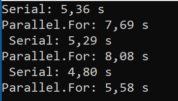

# Parallel Loop VS Normal Loop

### Parallel For

A loop iterates over a method call many times. Sometimes, the method calls can be called in a parallel way in any order.

Using parallel calls, we can for example speed up some programs by 4 times on a quad-core processor .  
This is a big improvement. We can use **Parallel.For** to make this optimization easier.  
But sometimes (as we will see in this example), we obtain as a result worse time than sequential for.

**[Potential Pitfalls in Data and Task Parallelism: ](https://docs.microsoft.com/en-us/dotnet/standard/parallel-programming/potential-pitfalls-in-data-and-task-parallelism) Do Not Assume That Parallel Is Always Faster**

> In certain cases a **parallel loop might run slower than its sequential equivalent**. The basic rule of thumb is that parallel loops that have few iterations and fast user delegates are unlikely to speedup much. However, because many factors are involved in performance, we recommend that you always measure actual results.


### Sequential Loop*

```c#
    static void Serial(double[] array, double factor)
        {
            for (int i = 0; i < array.Length; i++)
            {
                array[i] = array[i] * factor;
            }
        }
```


### Parallel Loop

```C#
        static void ParallelFor(double[] array, double factor)
        {
            Parallel.For(
                0, array.Length, i => { array[i] = array[i] * factor; });
        }
```


The **output** is:




**To Consider:**
 This program is running on a virtual machine, so it also influences the execution time of it.


