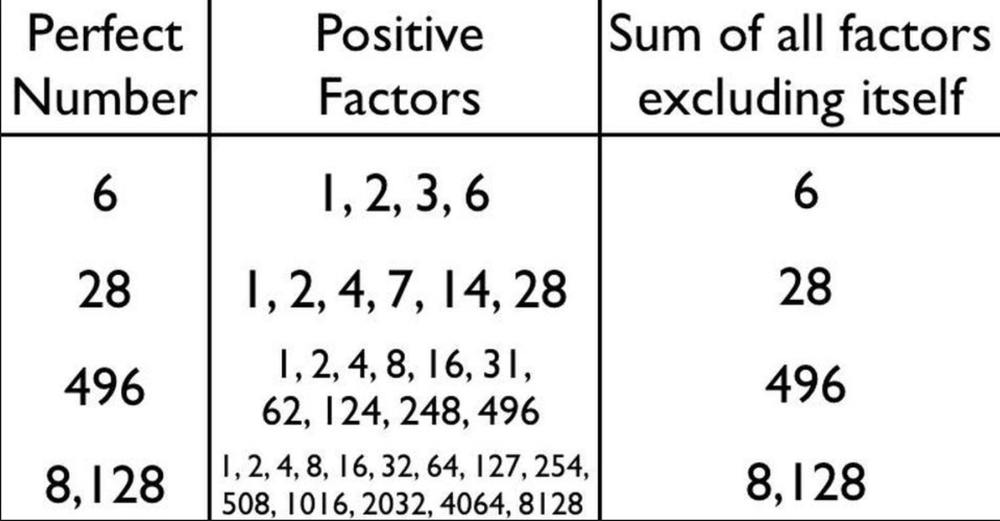
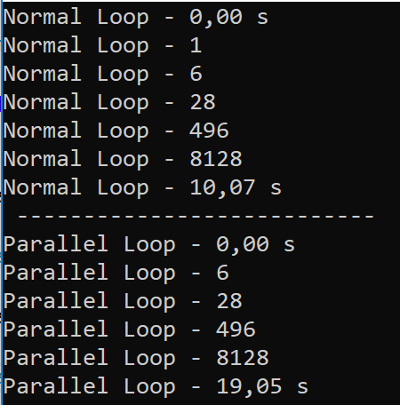

# Perfect Number (Parallel vs Tasks)

### What is "Perfect Number"?

Perfect number is a positive integer that is equal to the sum of its proper divisors.  
The smallest perfect number is 6, which is the sum of 1, 2, and 3.  
Other perfect numbers are 28, 496, and 8,128.




### PerfectNumberParallel.cs

**Method to Calculate Perfect number with** *Normal For* 

```c#
 static bool PerfectNumbers(long n)
    {
        long s = 0;
        for (int i = 1; i <= n / 2 + 1; i++)
        {
            if (n % i == 0)
            {
                s += i;
            }
        }
        if (n == s) return true;
        else return false;
    }
```

**Method where we call perfect number function some times**  
To calculate the time from the beginning we use **StopWatch** from namespace 
**[System.Diagnostics](https://docs.microsoft.com/en-us/dotnet/api/system.diagnostics?view=netframework-4.7.2)**


```c#
    static void GoPerfect(int a, int b, string m)
    {
        Stopwatch sw = Stopwatch.StartNew();

        Console.WriteLine(m + " - {0:f2} s", sw.Elapsed.TotalSeconds);

        for (int i = a; i <= b; i++)
        {
            if (PerfectNumbers(i))
            {
                Console.WriteLine(m + " - " + i);
            }
        }
        Console.WriteLine(m + " - {0:f2} s", sw.Elapsed.TotalSeconds);
    }

```

We call the method **GoPerfect** in main:

```c#
        GoPerfect(1, 50000, "Normal Loop");
```


The **output** is:



As we can see in the **output**, in my computer the time to calculate perfect number using **normal loop** is **lower** than using **parallel for**  
It can be explained:
####*[Potential Pitfalls in Data and Task Parallelism: ](https://docs.microsoft.com/en-us/dotnet/standard/parallel-programming/potential-pitfalls-in-data-and-task-parallelism)*Do Not Assume That Parallel Is Always Faster

> In certain cases a **parallel loop might run slower than its sequential equivalent**. The basic rule of thumb is that parallel loops that have few iterations and fast user delegates are unlikely to speedup much. However, because many factors are involved in performance, we recommend that you always measure actual results.


### PerfectNumberTasks.cs


**To Consider:**
 This program is running on a virtual machine, so it also influences the execution time of it.


