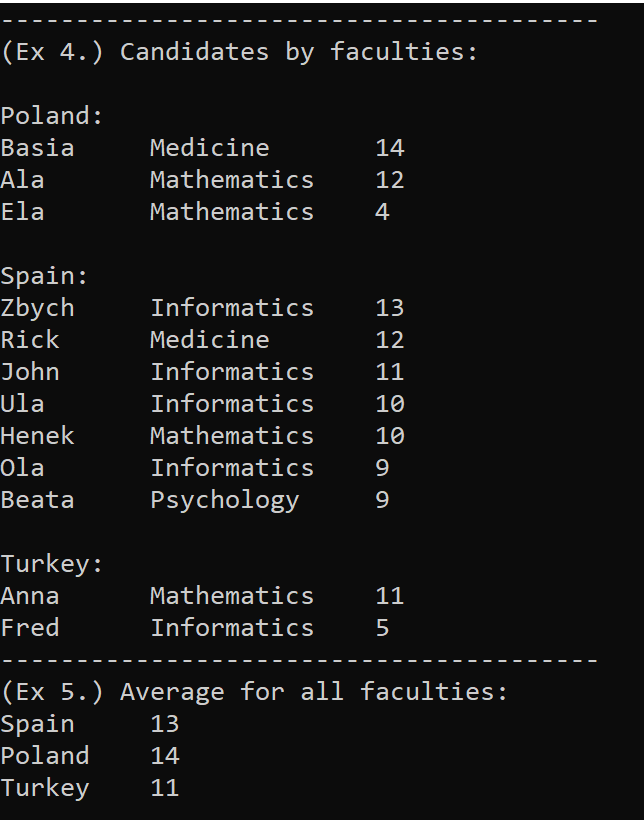
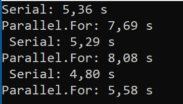

# Concurrent Programming Examples

* LINQAverage.cs - First example of LINQ to calculate the average of different countries student's marks.
	*  The output is:
	

* Perfect Numbers (2 Versions) - Program to calculate perfect numbers
	*  PerfectNumbersParallel.cs - with parallel for
	*  PerfectNumbersThreads.cs - With different threads

* CreatingThreads.cs - Creating diffent threads

* ThreadsJoin.cs - Program to create different threads using Join

* Parallel VS Normal Loop
	*  Program with two loops, one parallel loop and the other one normal loop. As we can see in the output, in my computer the result is:
			
	

