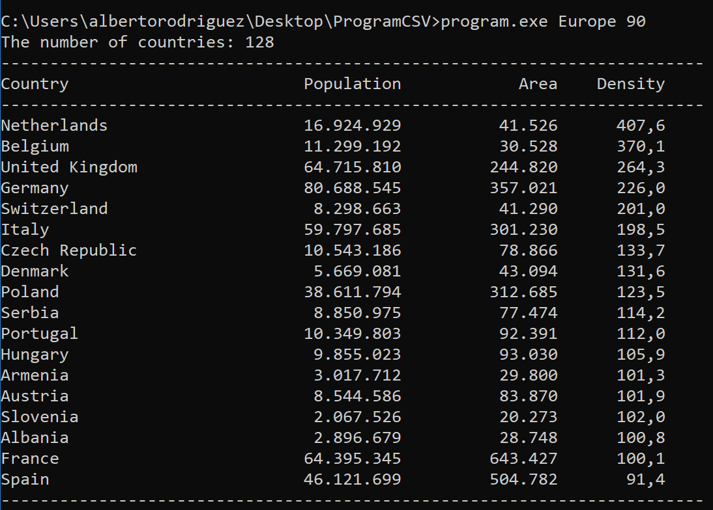
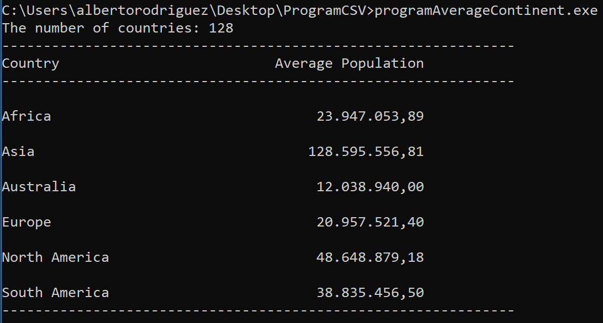

# Read data from CSV file


* **How to compile?**

```cmd
c:\Windows\Microsoft.NET\Framework\v4.0.30319\csc.exe "nameofprogram".cs
```
	

## program.cs

* **How to run the program?**

```cmd
program.exe Europe 90
```

Where "Europe" is the continent about you want to display the information, on this case, only countries with bigger density than "90".

The **output** is:




## programAverageContinent.cs

* **How to run the program?**

```cmd
programAverageContinent.exe 
```

The **output** is:



## programSumContinent.cs

* **How to run the program?**

```cmd
programSumContinent.exe 
```


