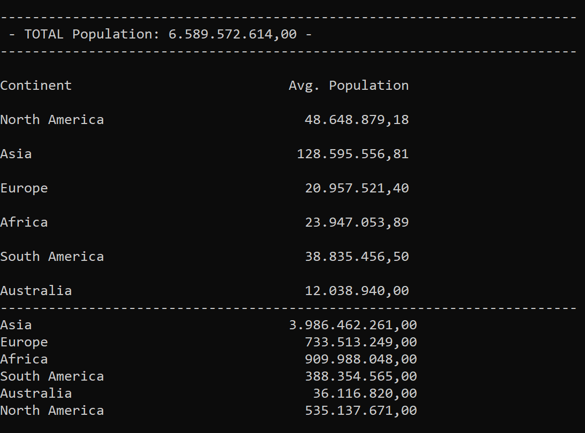

# Read data from CSV file


* **How to compile?**

```cmd
c:\Windows\Microsoft.NET\Framework\v4.0.30319\csc.exe "nameofprogram".cs
```
	

## program.cs

* **How to run the program?**

```cmd
program.exe Europe 90
```

Where "Europe" is the continent about you want to display the information, on this case, only countries with bigger density than "90".


**Read Arguments**

```c#
 String[] args = Environment.GetCommandLineArgs();
        if (args.Length == 1 || args.Length == 2) {
         Console.WriteLine("There are no command line arguments.");
         return;
        }
```


**Query where we choose the information that we want to display and we execute the query**
```c#
  var result = from c in Countries
            where (c.Continent == theContinent) && (c.Population / c.Area > theDensity)
            orderby c.Population/c.Area descending
            select c;

        foreach(Country c in result){
            Console.WriteLine(String.Format("{0, -25} {1, 15:n0} {2, 15:n0} {3, 10:n1}", c.Name, c.Population, c.Area, (1.0*c.Population/c.Area)));
        }  
```

With the method **GetCountries** we read the information from csv file

```c#
public static IEnumerable<Country> GetCountries()
    {
        var countries = System.IO.File.ReadAllLines("data.csv");
 
    
        return (from line in countries
                let fields = line.Split(',')
                
                select new Country()
                {
                    Name = fields[0].Trim(),
                    Continent = fields[1].Trim(),
                    Population = Convert.ToInt32(fields[2]),
                    Area = Convert.ToInt32(fields[3].Trim()), 
                    Gdp2010 = Convert.ToDouble(fields[6].Trim())
                });
               
    }

```


With method **Trim** we removes from the current string all leading and trailing white-space characters.   
Here we also **convert** the *String* to *intiger* type and *double*.

```c#
Name = fields[0].Trim(),
                    Continent = fields[1].Trim(),
                    Population = Convert.ToInt32(fields[2]),
                    Area = Convert.ToInt32(fields[3].Trim()), 
                    Gdp2010 = Convert.ToDouble(fields[6].Trim())
```


The **output** is:


## programAverageContinent.cs

* **How to run the program?**

```cmd
programAverageContinent.exe 
```

The **output** is:


## programSumContinent.cs

* **How to run the program?**

```cmd
programSumContinent.exe 
```


The **output** is:




