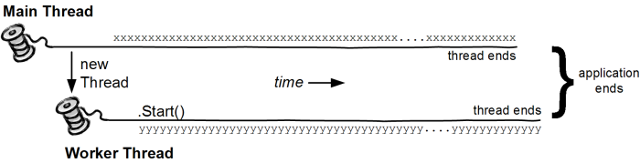
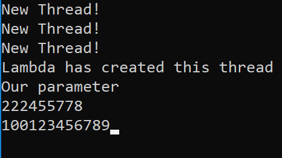
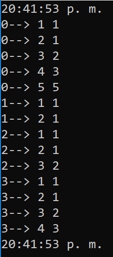

# THREADS IN C#

### ¿What is "Thread"?

A thread is defined as the execution path of a program. Each thread defines a unique flow of control. If your application involves complicated and time consuming operations, then it is often helpful to set different execution paths or threads, with each thread performing a particular job.



    


### Starting a thread in C#

We can start a thread in C# by using the Thread class present under the System.Thread namespace in the following way.


```c#
using System.Threading;

 Thread t = new Thread(new ThreadStart(Go));
        t.Start();   // Run Go() on the new thread.
        Go();        // Simultaneously run Go() in the main thread.

        Thread t2 = new Thread(Go);    // No need to explicitly use ThreadStart
        t2.Start();

        Thread t3 = new Thread(() => Console.WriteLine("Lambda has created this thread"));
        t3.Start();

        Thread t4 = new Thread(() => Print("Our parameter"));
        t4.Start();

```

### JOIN Method C#

In the example *ThreadsJoin.cs* we have used Join() method provided by the thread class. It is a **blocking mechanism** which allows one thread to wait until another thread completes its execution. In our case, for example t3 is a Thread object whose thread is currently executing, then t3.Join() causes the current thread to pause its execution until thread it joins completes its execution.

```c#
    static void Main()
    {
        string start = DateTime.Now.ToString("HH:mm:ss tt");
        string stop;
        Console.WriteLine(start);

        Go(5, "0--> ");

        Thread t = new Thread(() => Go(2, "1--> "));
        t.Start();

        Thread t2 = new Thread(() => Go(3, "2--> "));
        t2.Start();


        Thread t3 = new Thread(() => Go(4, "3--> "));
        t3.Start();
        t3.Join();

        Thread t4 = new Thread(() => Print(DateTime.Now.ToString("HH:mm:ss tt")));
        t4.Start();

        Console.ReadKey();
    }
```


The **output** of the program *CreatingThreads.cs* :




The **output** of the program *ThreadsJoin.cs* :




**Information Source:**

*[https://www.tutorialspoint.com/](https://www.tutorialspoint.com/csharp/csharp_multithreading.htm)*

*[https://www.dotnetforall.com/](https://www.dotnetforall.com/multithreading-in-csharp-basics/)*

*[https://www.geeksforgeeks.org/](https://www.geeksforgeeks.org/joining-threads-in-c-sharp/)*